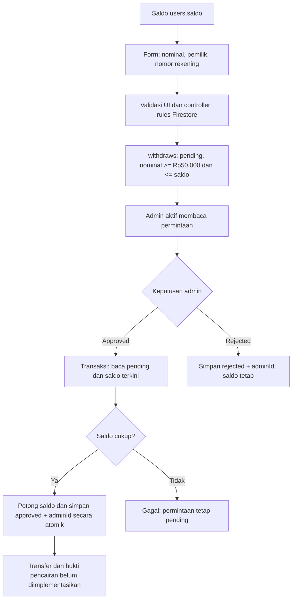

# Audit chat, transaksi, dan withdraw

Tanggal: 4 Oktober 2026. Audit kode lokal Flutter/GetX, Firebase Auth, Cloud Firestore, dan aturan Firestore. Tidak membaca atau mengubah saldo produksi, melakukan pembayaran, menambahkan kredensial, atau memasang gateway. Lampiran berisi permintaan teks saja; screenshot tidak tersedia. Aturan lokal belum dideploy dan konfigurasi rules produksi belum diverifikasi.

## 1. Penerima chat dan nama CEO Rifki

| Jalur | Sumber penerima | Lokasi kode |
| --- | --- | --- |
| Profil → Chat Admin | Query `users` dengan `role == admin`, lalu dokumen pertama yang `status == active` dan ID bukan UID login | `lib/app/modules/profile/controllers/profile_controller.dart`, `openAdminChat()` (sekitar baris 35–79); tombol di `profile_view.dart` sekitar 705, 958, 1057 |
| Detail mentor → chat pendampingan | `mentor.id` yang dipilih; order terbaru dengan mentor, jenis layanan, dan status `progress`/`approved` | `lib/app/modules/paperlink/views/detail_mentor_view.dart`, sekitar 77–95; `order_history_controller.dart`, `hasProgressOrder()` dan `getProgressOrderId()` |
| Daftar percakapan | Anggota lain dalam `chatRooms.users`; order ID mengikuti room | `lib/app/modules/chat/controllers/chat_controller.dart`, `_loadCustomerChats()`; `chat_list_view.dart`, `_openConversation()` |
| Daftar mentor | Setiap order aktif menggunakan `orders.userId` sebagai pelanggan; room yang sudah ada tetap ditampilkan, termasuk riwayat | `chat_controller.dart`, `_loadMentorChats()` dan `_publishChats()` |
| Admin memulai chat | ID kontak customer yang dipilih, dari koleksi `users` | `chat_list_view.dart`, `_startAdminConversation()`; `chat_controller.dart`, `loadAdminContacts()` |

`openAdminChat()` membentuk ID room dengan dua UID yang diurutkan dan digabung `_`, lalu meneruskan ID admin ke `Routes.chatRoom(admin.id)`. Nama header berasal dari `users.nama` atau `namaLengkap`. Room pendampingan menambahkan `_orderId` pada ID pasangan UID. Tidak ditemukan string atau ID hardcode CEO Rifki dalam kode chat aktif.

Dengan demikian, **jalur Chat Admin dapat mengarah ke CEO Rifki apabila dokumen akun tersebut menjadi admin aktif pertama hasil query**. Identitas dan urutan dokumen backend aktual belum diperiksa, sehingga kondisi tersebut bukan konfirmasi data produksi. Jika pengguna membuka room lama, penerima ditentukan anggota room itu. Jika masuk lewat detail mentor, penerima mengikuti mentor yang dipilih.

Pemilihan admin belum memiliki penugasan admin layanan, prioritas, atau konfigurasi support. Kode pemilihan tersebut tidak diubah karena belum ada dasar bisnis untuk mengganti penerima. Pertanyaan: apakah semua admin aktif boleh menerima bantuan, atau perlu admin tertentu berdasarkan layanan/pesanan? Tentukan sumber penugasannya, bukan sekadar nama tampilan.

Perbaikan relasi yang jelas: daftar mentor sebelumnya menggabungkan beberapa order pelanggan menjadi satu order terakhir; daftar sekarang mempertahankan room per order serta memperbarui preview lewat listener room realtime.

## 2. Status baca dan badge

Sebelumnya `DashboardView` memakai `chatRoomCount`, sehingga satu percakapan menghasilkan badge 1 walaupun tidak ada pesan masuk baru. Model dan dokumen pesan belum menyimpan status baca, dan rules menolak semua update pesan.

Sesudah perubahan:

- Pesan baru menyimpan `readAt: null`; setelah dibaca, penerima menyimpan server timestamp.
- Model `ChatMessage` membawa `readAt` dan `isUnreadFor(uid)`.
- Badge memakai `unreadMessageCount`, bukan jumlah room. Room diambil dengan `users arrayContains UID`, kemudian pesan per room dengan `receiverId == UID`; yang dihitung hanya `senderId != UID` dan `readAt == null`.
- Pesan lama tanpa `readAt` diperlakukan sebagai belum dibaca sampai percakapan dibuka. Riwayat lama tidak dapat dibedakan antara pernah/belum dibaca karena sebelumnya tidak ada bukti baca; tidak ada migrasi massal atau penghapusan data.
- Saat room dibuka atau pesan masuk pada room yang terbuka, pesan masuk ditandai dibaca dalam transaksi, maksimal 400 dokumen per kelompok. Transaksi membaca status terbaru dahulu agar dua perangkat tidak menimpa receipt yang sudah disimpan.
- Menutup room membatalkan listener pesan; aplikasi yang berada di background berhenti menandai pesan masuk. Saat kembali aktif, penyimpanan status baca dilanjutkan. Kegagalan status baca memiliki pesan error dan tombol retry.
- Pergantian UID/logout membersihkan subscription, cache, dan badge. Chat tidak lagi memakai UID dummy `u1` atau otomatis membuat sesi anonim.
- Rules mengizinkan hanya penerima anggota room menambahkan `readAt == request.time`; konten, pengirim, penerima, dan timestamp pesan tidak boleh diubah. Pesan ke diri sendiri dan receipt palsu saat pengiriman ditolak.
- Pengiriman pesan dan preview room menjadi satu batch atomik. Kegagalan pesan tidak meninggalkan preview seolah-olah pesan telah terkirim. Pembuatan room menggunakan merge identitas sebelum pembacaan, mengikuti aturan member-only untuk room yang belum ada.
- Badge mobile tetap mengikuti jumlah pesan sebenarnya ketika tab Chat dipilih; pemilihan tab sendiri tidak menandai seluruh room dibaca.

Biaya/skala: implementasi menjaga kompatibilitas pesan lama dan menggunakan listener per room tanpa collection-group index baru. Listener menerima seluruh pesan masuk di room, lalu memfilter status baca di aplikasi; untuk volume besar, rancang counter terverifikasi backend, pagination, dan migrasi status baca. Ini tidak membuat ledger atau backend baru.

## 3. Tampilan chat ponsel

`chat_room_view.dart` mempertahankan warna, font Poppins, header/avatar, navigasi, loading, empty state, dan error yang sudah ada. Bubble menggunakan maksimal 85% lebar area pesan pada ponsel dan 72% pada layar besar, dengan batas 620 px; minimum paksa 180 px dihapus agar area sangat sempit tidak overflow.

Composer menjadi komponen `ChatMessageComposer` yang dapat diuji, tetap di bawah daftar pesan, dengan input 1–4 baris dan tombol kirim 48 px. `SafeArea` dan `resizeToAvoidBottomInset: true` mempertahankan composer di atas keyboard serta area navigasi sistem. Room memiliki lifecycle agar rebuild keyboard tidak memulai subscription ulang. Scroll ke pesan terakhir dilakukan setelah layout. Separator tanggal kini mengikuti tanggal pesan, bukan selalu menampilkan “Hari ini” untuk seluruh riwayat.

Tes menguji bubble pada area 160, 284, 664, dan 1064 px; header yang sudah ada pada 320, 700, dan 1100 px; composer pada viewport 320, 700, dan 1100 px dengan keyboard simulasi 300 px. Belum ada validasi visual terhadap screenshot atau perangkat fisik.

## 4. Peta transaksi yang ditemukan

| Bagian | Implementasi nyata | Kekurangan/keputusan |
| --- | --- | --- |
| Pendampingan Paperlink/Complink | `order_controller.dart:createOrder()` menyimpan `orders` dengan user, mentor, layanan, harga, bukti, dan status `waiting verification`. Detail mentor membuka form, bukan gateway. | Harga dari layanan; fallback UI `100000` di `detail_mentor_view.dart:109`. Rules menuntut harga sama dengan `layanan.harga`, sehingga fallback dapat menyebabkan order ditolak. Penugasan mentor/jenis layanan belum divalidasi lengkap oleh rules. |
| Pembayaran | QRIS gambar statis `assets/images/qrqris.jpeg` di `payment_checkout_widgets.dart`, `kuesioner_payment_dialog_view.dart`, dan `sourcelink_submit_view.dart`; bukti diunggah lewat `MediaUploadService` ke Cloudinary, URL disimpan di order. | Gambar bukan status pembayaran terverifikasi. Tidak ada webhook, payment intent, provider transaction ID, rekonsiliasi, atau validasi bukti benar-benar membayar. Upload membutuhkan build define preset yang sudah didukung; konfigurasi aktual tidak diverifikasi/diubah. Rules URL terkait cloud name default tertentu. |
| Verifikasi order umum | Admin aktif memverifikasi lewat `admin_orders_controller.dart:updateOrderStatus()`: pending/waiting → progress/approved atau rejected; progress/approved → completed. Verifikasi pertama mengkredit **seluruh price** ke `users/{mentorId}.saldo`. | Tidak ditemukan perhitungan komisi, biaya, pembagian pendapatan, refund, atau hold sampai layanan selesai. Saldo bertambah ketika verifikasi, bukan saat selesai. |
| Kuesioner/Sourcelink | Harga `25000` hardcode di controller/UI dan rules. `mentorId` menggunakan admin pertama query atau fallback `system`. Sourcelink menulis order+kuesioner dalam batch; alur create kuesioner menyimpan order dahulu lalu formulir kuesioner. | Jalur kedua dapat meninggalkan order tanpa kuesioner bila pengguna batal. ID admin digunakan sebagai mentor keuangan; perlu pemisahan penerima layanan dan penerima pendapatan. |
| Verifikasi kuesioner | `admin_kuesioner_controller.dart:updateKuesionerStatus()` memperbarui kuesioner dan order bersamaan; approved kuesioner → progress order. | Tidak menambah saldo. Bila order yang sama diverifikasi lewat halaman order umum, saldo admin dapat bertambah Rp25.000. Dua jalur memiliki efek uang berbeda; belum diubah karena pemilik pendapatan belum ditentukan. |
| Hadiah responden | `kuesioner_detail_view.dart:_registerRespondent()` mencoba menambah `signedBy` dan saldo Rp100 dalam transaksi dari client. | Rules menolak update kuesioner/saldo oleh customer. Jadi imbalan ini tidak berjalan dengan rules lokal saat ini. Belum ada fungsi backend reward; penentuan kapan hadiah sah, anti-duplikasi, dan sumber dananya perlu keputusan. |
| Saldo | Dibaca realtime dari `users.saldo` oleh `profile_controller.dart`; ketiadaan field menghasilkan 0. Sumber tulisan: verifikasi order admin, usaha reward responden yang ditolak, pengurangan withdraw, serta kemampuan admin mengubah data user. | Bukan saldo rekening bank. Tidak ada ledger pendapatan/debit, saldo reserved, audit rekonsiliasi, atau transaksi gateway. |
| Withdraw | `withdraw_controller.dart`, `withdraw_dialog_view.dart`, `withdraw_model.dart`, `admin_withdraw_controller.dart`, `admin_withdraw_view.dart`, rules `/withdraws`. | Koleksi permintaan, bukan pengiriman uang. Rekening hanya nama+nomor; bank/jenis e-wallet, biaya, bukti transfer, dan riwayat withdraw khusus pemilik belum tersedia. Customer melihat tombol wallet tetapi rules hanya mengizinkan mentor; hak customer perlu diputuskan. |
| Dummy/langganan | `lib/app/data/dummy_chats.dart` ada tetapi tidak ditemukan import pada chat aktif. Tidak ditemukan alur langganan berbayar/topup, API pembayaran custom, atau backend/functions pembayaran pada proyek yang diperiksa. | Data katalog/demografi dummy bukan bukti transaksi. Saldo Rp0 di UI berasal dari dokumen user/default, bukan saldo gateway dummy. |

## 5. Alur withdraw setelah perbaikan

Minimum Rp50.000 telah diverifikasi di kode form/controller. Sebelumnya rules hanya mensyaratkan nominal positif; sekarang rules juga mensyaratkan minimum Rp50.000, saldo cukup, mentor aktif, nama rekening berisi, dan nomor rekening angka. Saldo Rp0 menyebabkan pengajuan tidak lolos. Controller membaca saldo lagi, sehingga tidak hanya mengandalkan nilai yang dipasok saat dialog dibuka. Guard mencegah submit ganda ketika request yang sama sedang diproses.

Pengajuan pending **tidak memotong atau mereservasi saldo**. Saat persetujuan, transaksi membaca ulang withdraw dan user sehingga persetujuan bersamaan tidak menyebabkan saldo negatif. Hanya pending boleh berubah ke approved/rejected dalam controller, mengikuti tombol UI yang sudah ada. Sebelumnya fungsi juga bisa membalik approved → rejected dan mengembalikan saldo tanpa bukti refund; fungsi itu sekarang menolak perubahan status terminal. Dokumen lama tidak diubah. Status `completed` ada pada label/model, tetapi tidak ditemukan proses yang menetapkannya atau membuktikan pencairan.

Risiko yang belum selesai: dua pengajuan pending dapat masing-masing lolos terhadap saldo yang sama. Contoh saldo Rp100.000 dan dua permintaan Rp80.000: keduanya dapat tersimpan pending; setelah yang pertama disetujui, yang kedua gagal karena saldo Rp20.000. Usulan: backend atomik untuk reservasi, saldo tersedia = saldo total − reserved, pelepasan reservasi saat rejected, idempotency key, serta audit ledger. Tidak menerapkan skema reservasi tanpa keputusan cara migrasi pending lama dan definisi persetujuan/pencairan.

Verifikasi order umum sebelumnya membaca status di luar transaksi lalu menambah saldo dalam batch; dua admin dapat sama-sama melihat order belum diverifikasi dan mengkredit dua kali. Sekarang pembacaan status, perubahan status, serta increment saldo dilakukan dalam satu transaksi dan transisi mengikuti aksi UI; konflik akan membaca ulang status dan menolak approval ulang. Ini memperbaiki jalur controller tersebut, bukan membatasi semua penulisan uang oleh admin: rules masih memberi admin hak luas atas users/orders/withdraws, dan belum memaksakan ledger atau pasangan debit/status pada server.

## 6. Keputusan sebelum gateway

1. Penerima support: semua admin aktif atau admin layanan tertentu; sumber assignment resmi.
2. Hak withdraw mentor saja atau juga customer; rekening bank/e-wallet mana, bank/jenis tujuan, biaya, dan verifikasi kepemilikan.
3. Saldo tersedia dan reservasi pending; batas pengajuan, idempotency, serta migrasi pending lama.
4. Arti approved vs paid/completed, pihak yang mentransfer, bukti pencairan, kegagalan transfer, dan kebijakan refund/reversal.
5. Pembagian pendapatan/komisi, kapan pendapatan menjadi dapat ditarik, serta penerima pendapatan kuesioner yang konsisten di kedua jalur verifikasi.
6. Imbalan responden: Rp100 masih berlaku atau tidak, kapan diperoleh, sumber dana, dan backend yang memverifikasi klaim.
7. Harga katalog/fallback, tarif kuesioner, dan penanganan order tanpa kuesioner; selaraskan rules dan sumber harga.
8. Setelah aturan bisnis jelas: pilih gateway, rancang backend terpercaya, ledger, webhook bertanda tangan, idempotency, audit, dan rekonsiliasi. Belum memilih provider atau melakukan integrasi.

## 7. File yang berubah dan validasi

- `lib/app/data/models/chat_model.dart`: status baca dan predicate incoming.
- `lib/app/modules/chat/controllers/chat_controller.dart`: badge, receipt, sesi, room merge, pengiriman atomik, dan daftar mentor.
- `lib/app/modules/chat/views/chat_room_view.dart`: lifecycle, bubble, separator tanggal, composer, dan error receipt.
- `lib/app/modules/dashboard/views/dashboard_view.dart`: badge unread.
- `lib/app/data/widgets/bottom_navbar.dart`: badge mengikuti unread pada tab aktif juga.
- `lib/app/modules/profile/controllers/withdraw_controller.dart`: guard submit dan validasi role/rekening.
- `lib/app/modules/admin_withdraw/controllers/admin_withdraw_controller.dart`: transisi pending dan validasi data.
- `lib/app/modules/admin_orders/controllers/admin_orders_controller.dart`: transaksi approval dan validasi transisi.
- `firestore.rules`: receipt message dan minimum/rekening withdraw.
- `firebase-tests/firestore.rules.test.js`: tes izin receipt, batch atomik, room merge, dan withdraw.
- `test/chat_read_status_test.dart`: eligibility badge, serialisasi receipt, bubble sempit, dan composer dengan keyboard.
- Dokumen audit ini.

Validasi: `flutter test --no-pub --reporter expanded` **149 tes lulus**. `node --test firestore.rules.test.js` dengan emulator lokal project `demo-cermatify` **12 tes lulus**. `flutter analyze --no-pub`: **No issues found**. `git diff --check`: **lulus**. Emulator dijalankan dengan JAR cache lokal, tanpa koneksi produksi. Tes rules memverifikasi hak akses dan validasi, bukan aliran transfer uang. Log Flutter: `build/audit-flutter-test.log` (artifact build, tidak dikomit).

Batas validasi: tidak menguji dua admin melalui aplikasi end-to-end, perangkat fisik, data akun CEO Rifki aktual, aturan produksi yang terdeploy, upload Cloudinary nyata, atau pembayaran/transfer. Receipt baru membutuhkan deployment rules yang kompatibel sebelum aplikasi diperbarui; deployment belum dilakukan pada tahap audit ini.
